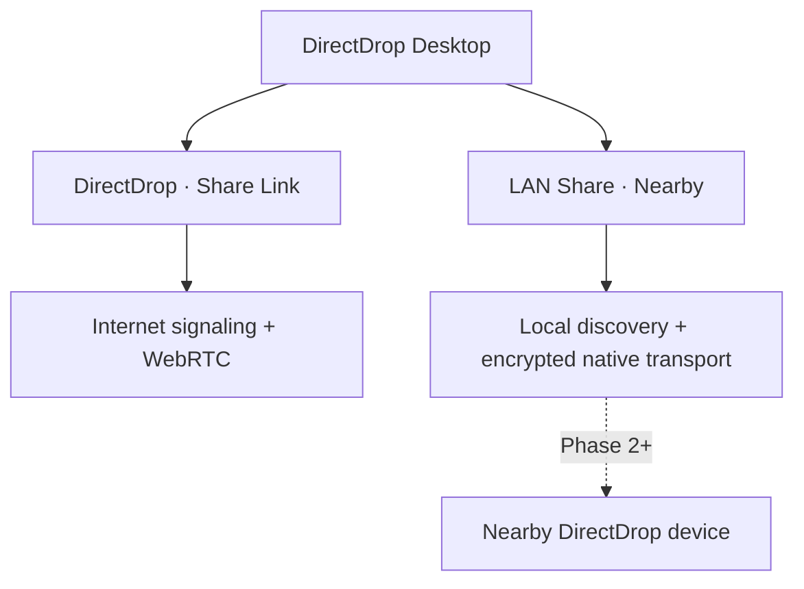
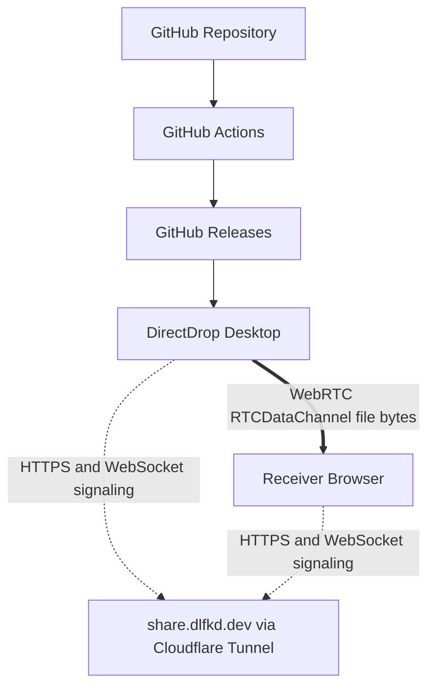

# DirectDrop Architecture



`DirectDrop`과 `LAN Share`는 UI 상태와 파일 선택 큐가 분리되어 있습니다. 공통 진행 상태와 transport 경계는 `apps/desktop/src/transfer-contract.ts`에 정의합니다. 현재 `WebRTC` Share Link만 실제 전송을 수행하며, LAN discovery·listener·transport는 아직 실행하지 않습니다.

## DirectDrop · Share Link



## LAN Share · Nearby

Phase 1은 제품 모드, 화면, 파일 큐, 향후 transport 계약을 분리합니다. Phase 2부터 mDNS/DNS-SD discovery를 Rust backend에 추가하며, 외부 signaling 서버나 `share.dlfkd.dev`에 의존하지 않습니다. 세부 설계와 구현 상태는 [nearby.md](nearby.md)를 참고하세요.

## 신뢰 경계

`apps/server`는 share metadata, sender presence, download reservation, SDP/ICE 메시지만 처리합니다. 파일 업로드 endpoint와 서버 임시 파일 경로가 없습니다. `fileStorage: false`는 `/health`에서도 노출됩니다.

`apps/desktop`의 Rust 레지스트리가 무작위 `publicFileId`를 로컬 절대 경로에 매핑합니다. 브라우저와 서버에는 public ID와 정제된 표시 이름만 전달됩니다. Rust는 매 청크 읽기 전에 크기·mtime을 검사하고 read-only handle로 필요한 범위만 읽습니다.

수신자는 WebRTC DataChannel의 ordered binary chunk를 처리합니다. 총 512 MiB 이하인 일반 공유는 macOS 보호 폴더 권한을 요구하지 않고 메모리 버퍼를 거쳐 브라우저 기본 다운로드 방식으로 저장합니다. 512 MiB를 넘는 대용량 공유는 File System Access API writable stream에 바로 기록하며, 이 API가 없으면 메모리 사용 급증을 막기 위해 다운로드를 차단합니다.

## DownloadSession

```text
RESERVED → CONNECTING → TRANSFERRING → COMPLETED
     └───────────────→ FAILED / CANCELLED
```

예약은 SQLite transaction 안에서 `completed + active reservations < downloadLimit`를 검사합니다. 실패, 취소, 연결 종료, timeout은 slot을 반환합니다. 수신자의 저장 완료만 카운트를 정확히 한 번 올립니다.

## Cleanup

만료는 조회 시 lazy 처리합니다. 기본 `BACKGROUND_CLEANUP_MODE=off`에는 background loop가 없습니다. `auto`와 `always`는 서버 메타데이터만 정리하며 송신자 filesystem API에 접근할 수 없습니다.
