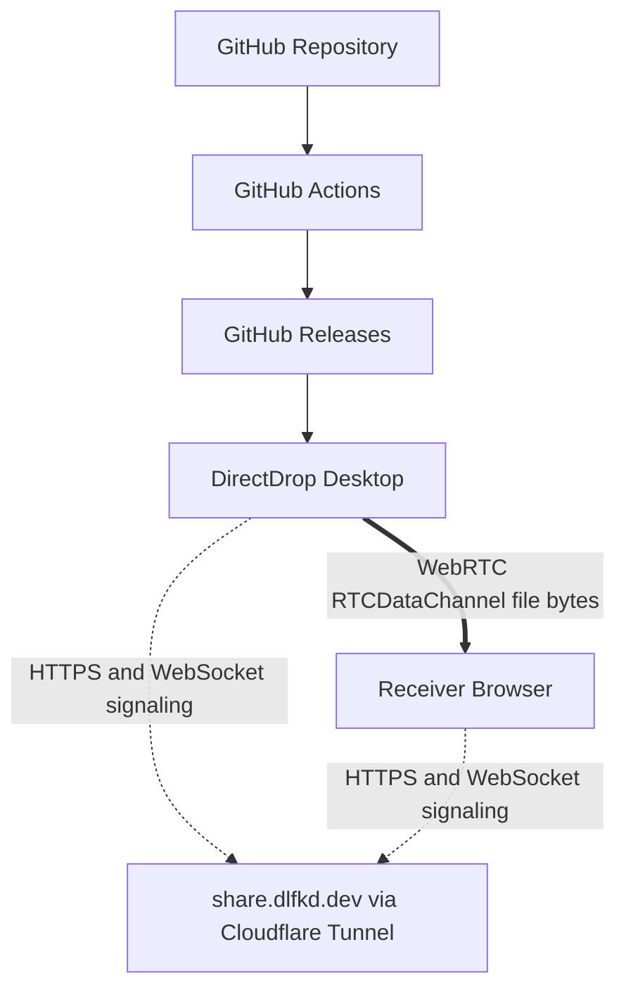

# DirectDrop Architecture



## 신뢰 경계

`apps/server`는 share metadata, sender presence, download reservation, SDP/ICE 메시지만 처리합니다. 파일 업로드 endpoint와 서버 임시 파일 경로가 없습니다. `fileStorage: false`는 `/health`에서도 노출됩니다.

`apps/desktop`의 Rust 레지스트리가 무작위 `publicFileId`를 로컬 절대 경로에 매핑합니다. 브라우저와 서버에는 public ID와 정제된 표시 이름만 전달됩니다. Rust는 매 청크 읽기 전에 크기·mtime을 검사하고 read-only handle로 필요한 범위만 읽습니다.

수신자는 WebRTC DataChannel의 ordered binary chunk를 File System Access API writable stream에 바로 기록합니다. 이 API가 없으면 총 512 MiB 이하에서만 메모리 fallback을 허용합니다.

## DownloadSession

```text
RESERVED → CONNECTING → TRANSFERRING → COMPLETED
     └───────────────→ FAILED / CANCELLED
```

예약은 SQLite transaction 안에서 `completed + active reservations < downloadLimit`를 검사합니다. 실패, 취소, 연결 종료, timeout은 slot을 반환합니다. 수신자의 저장 완료만 카운트를 정확히 한 번 올립니다.

## Cleanup

만료는 조회 시 lazy 처리합니다. 기본 `BACKGROUND_CLEANUP_MODE=off`에는 background loop가 없습니다. `auto`와 `always`는 서버 메타데이터만 정리하며 송신자 filesystem API에 접근할 수 없습니다.
